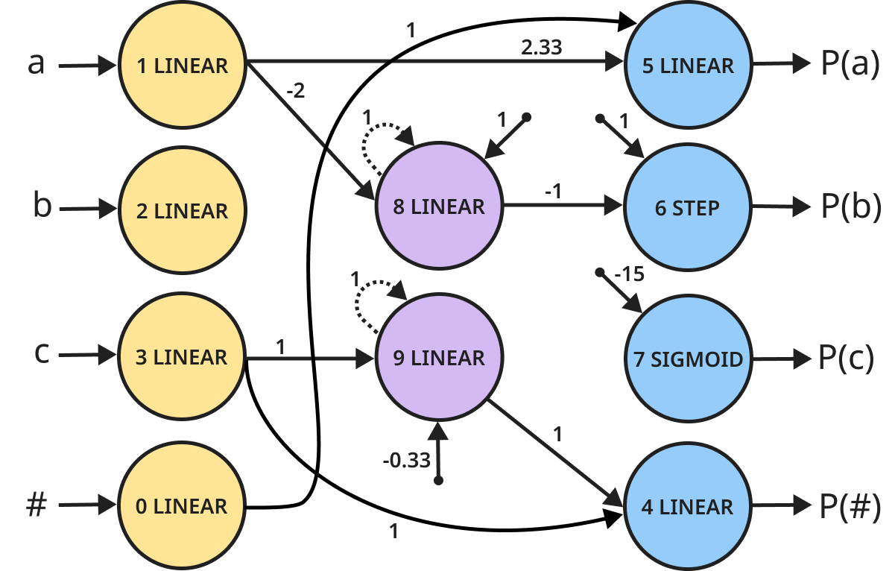

# Minimum Description Length Recurrent Neural Networks

Code for [Minimum Description Length Recurrent Neural Networks](https://arxiv.org/abs/2111.00600) by Nur Lan, Michal Geyer, Emmanuel Chemla, and Roni Katzir.

Paper: https://arxiv.org/abs/2111.00600

 

## Getting started
1. Install Python >= 3.7
2. `pip install -r requirements.txt`

### On Ubuntu, install:
```
$ apt-get install libsm6 libxext6 libxrender1 libffi-dev libopenmpi-dev
```

## Running simulations

```
$ python main.py --simulation <simulation_name> -n <number_of_islands>
```

For example, to run the `aⁿbⁿcⁿ` task using 16 island processes:
```
$ python main.py --simulation an_bn_cn -n 16
```

* All simulations are available in `simulations.py`

* Output networks are saved to the `networks` sub-directory. Visual representations of the networks are saved to `dot_files` in `dot` format.


## Parallelization

Native Python multiprocessing is used by default. To use MPI, change `migration_channel` to `mpi` in `simulations.py`.